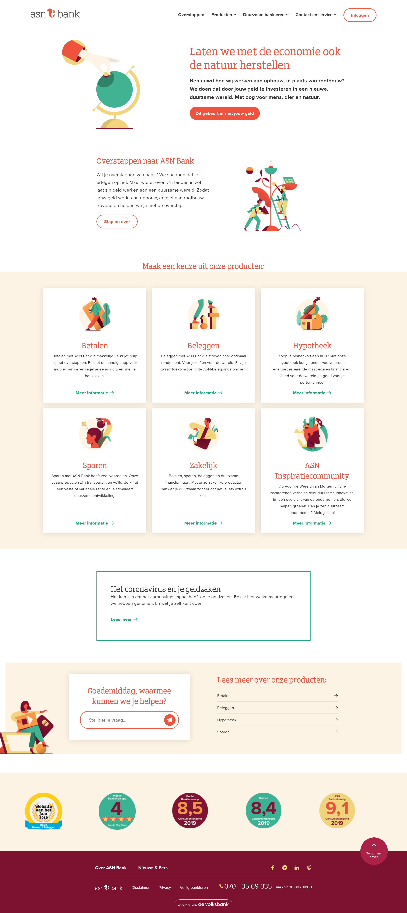
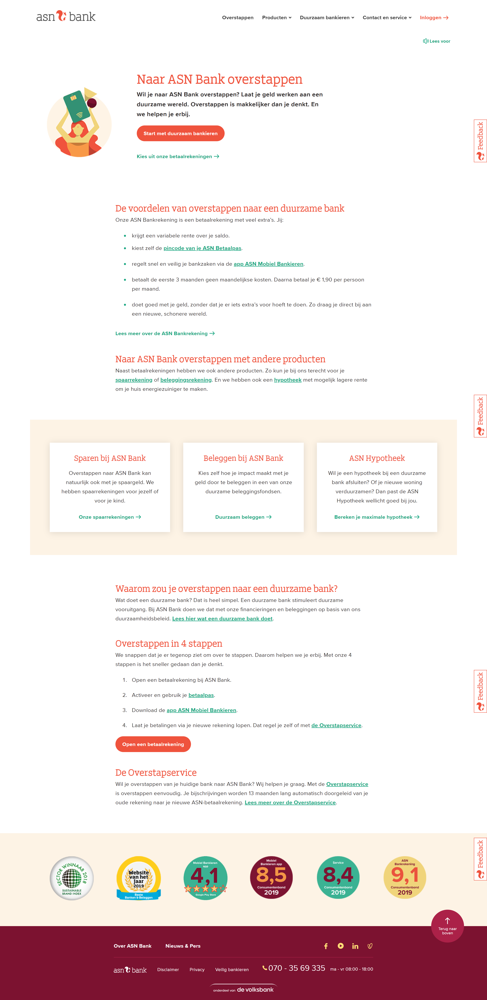
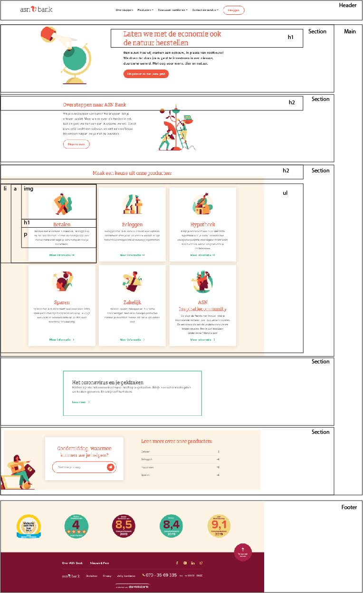

# Procesverslag
**Auteur:** -jouw naam-

Markdown cheat cheet: [Hulp bij het schrijven van Markdown](https://github.com/adam-p/markdown-here/wiki/Markdown-Cheatsheet). Nb. de standaardstructuur en de spartaanse opmaak zijn helemaal prima. Het gaat om de inhoud van je procesverslag. Besteedt de tijd voor pracht en praal aan je website.

## Bronnenlijst
1. -bron 1-
2. -bron 2-
3. -...-

## Eindgesprek (week 7/8)

-dit ging goed & dit was lastig-

**Screenshot(s):**

-screenshot(s) van je eindresultaat-

## Voortgang 3 (week 6)

-same as voortgang 1-

## Voortgang 2 (week 5)

-same as voortgang 1-

## Voortgang 1 (week 3)

### Stand van zaken

-dit ging goed & dit was lastig-

**Screenshot(s):**

-screenshot(s) van hoe ver je bent-

### Agenda voor meeting

-samen met je groepje opstellen-

### Verslag van meeting

-na afloop snel uitkomsten vastleggen-

## Intake (week 1)

**Je startniveau:** -Mijn niveau is Blauw zou ik zelf zeggen. Vorige keer heb ik het vak net niet gehaald omdat ik een microinteractie mist. Maar als ik het gevoel heb dat ik weet wat ik doe en het een beetje wil lukken. Is coderen wel heel leuk natuurlijk. Dit komt alleen zelden tot nooit voor.-

**Je focus:** -Ik wil gaan focussen op de surface design. Maar ik wil ook zeker een goed responsive site proberen te maken. Maar sommige dingen die ik zou willen proberen te ontwerpen zijn misschien moeilijk goed responsive te maken.-

**Je opdracht:** -https://www.asnbank.nl/home.html-

**Screenshot(s):**

![screenshot(s) die een goed beeld geven van de website die je gaat maken]
 
 

**Breakdown-schets(en):**

 
